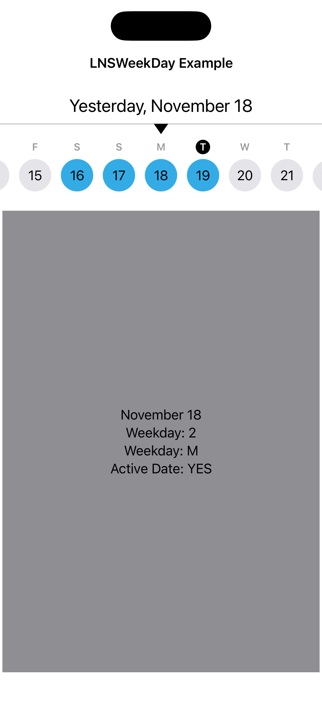

# LNSWeekView

A SwiftUI week-at-a-time calendar strip inspired by Apple's Fitness app. Provides a scrollable week view with per-day content pages, built on native iOS 17+ scroll APIs.



## Requirements

- iOS 17+ / macOS 14+
- Swift 6.0+
- Depends on [LNSSwiftUIExtras](https://github.com/alldritt/LNSSwiftUIExtras)

## Installation

Add the package to your project via Swift Package Manager:

```swift
.package(url: "https://github.com/alldritt/LNSWeekView.git", branch: "main")
```

## Views

### WeekView

A standalone scrollable week calendar strip with a header showing the selected date and a triangle indicator. Tap the header to return to today.

```swift
WeekView(dates: activeDates,
         selectedDate: $selectedDate) { date, today in
    // Custom day cell
    Circle()
        .foregroundStyle(activeDates.contains(date) ? .orange : .gray)
        .overlay(Text("\(date.dayOfMonth)"))
}
```

**Parameters:**

- `dates` — Set of active/highlighted dates
- `selectedDate` — Two-way binding for the currently selected date
- `content` — Builder for each day cell, receives the date and today's date

### WeekPageView

A container that combines `WeekView` with a horizontally pageable content area below. Swiping the content area navigates between days and keeps the week strip in sync.

```swift
WeekPageView(dates: activeDates,
             selectedDate: $selectedDate,
             activeOnly: false) { date, today in
    // Day cell for the week strip
    DateCalendarView(date: date, active: activeDates.contains(date))
} dayContent: { date in
    // Full-page content for the selected day
    Text("\(date.monthName) \(date.dayOfMonth)")
        .frame(maxWidth: .infinity, maxHeight: .infinity)
}
```

**Parameters:**

- `dates` — Set of active/highlighted dates
- `selectedDate` — Two-way binding for the currently selected date
- `activeOnly` — When `true`, swiping the content area skips non-active dates. Default `false`
- `dateContent` — Builder for each day cell in the week strip
- `dayContent` — Builder for the full-page content shown for the selected day

## License

MIT
